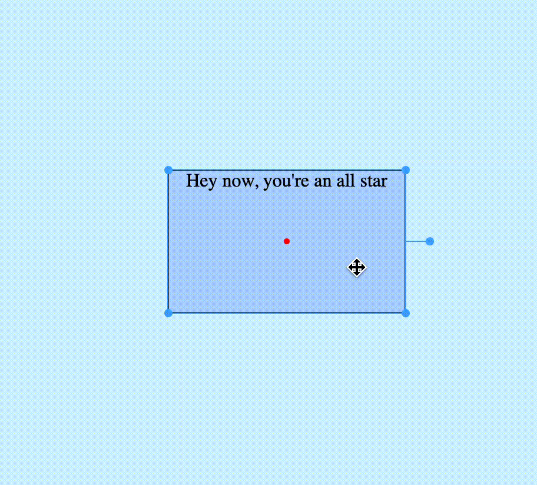
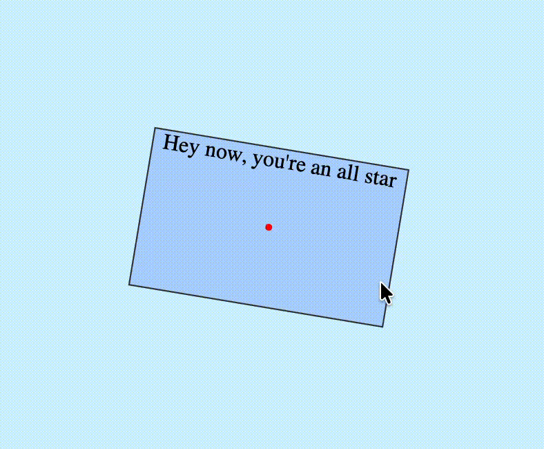
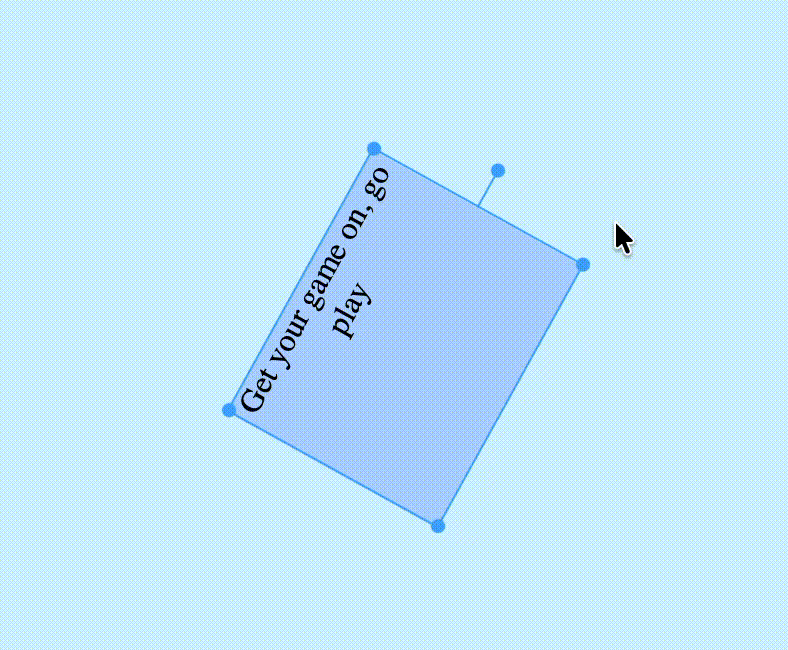
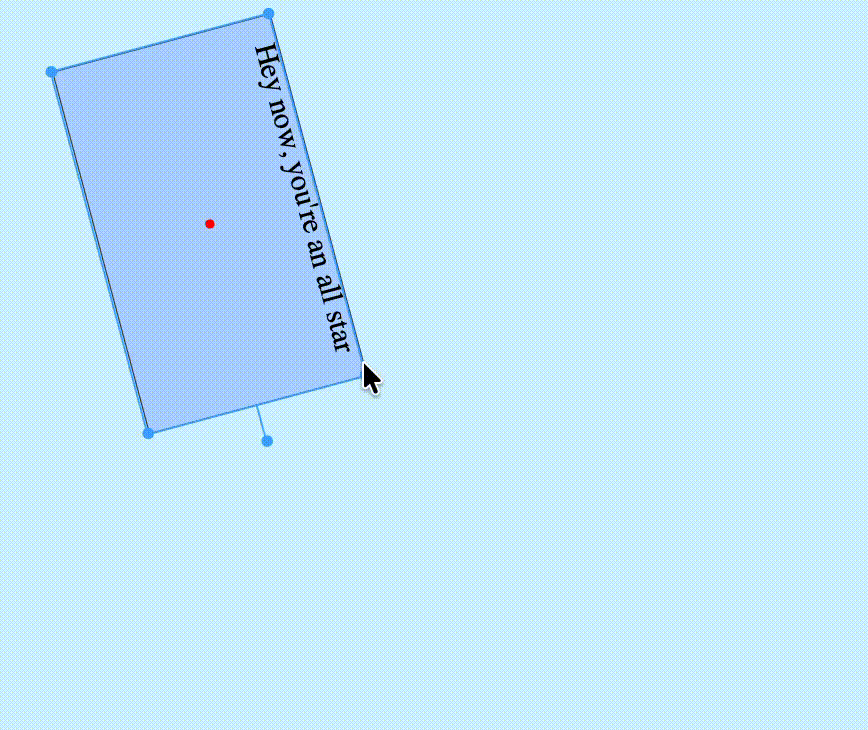
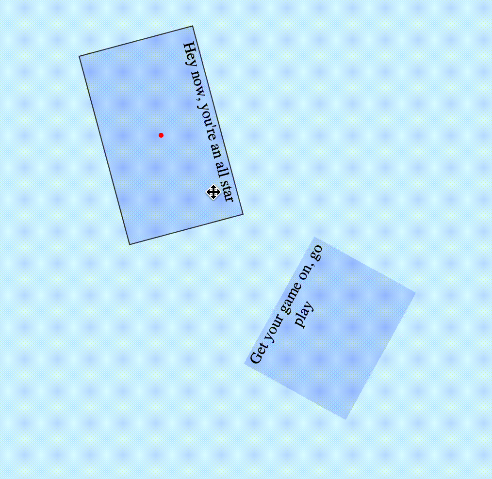
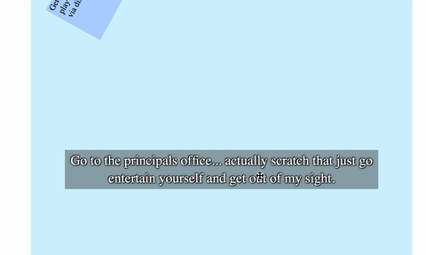

# Move it!


A library that adds simple PowerPoint like DOM object manipulation: resize, drag, and rotate. Pretty lightweight and comes with (very beautifully) styled controls. This library also provides the means for you to calculate collision via an implementation of oriented bounding boxes.



## Installing

Run `npm i @andynoob/move-it` and read on.

## The lifecycle

> Fully functional sample code can be found [here](playground/main.ts).

> Please ensure that the moving element is absolutely positioned, relative to the control root. Otherwise, expect the transform controls to be mis-fit around the moving element.

To start, create an instance of `Moving` by calling `createMoveMe` (or `MoveIt.createMoveMe`). For example:
```ts
const el = document.querySelector(/* ... */);
const controlRoot = el.parentElement!;
const snapping = {
  // omitted... we'll get to this later
};

const moving = createMoveMe(el, {
  initialState: { // optional, the code will call computeState on the target (first parameter) if this is absent
    x: 200,
    y: 200,
    width: 200,
    height: 120,
    rotation: 75,
    // when usePercent = true, the x, y, width, and height values become percentages (0-1) relative to the control root
    usePercent: false,
    // when centered = true, the RectState represents the center of the element. it is converted back to the default
    // top left by subtracting half width and half height to the x and y. this can be used with usePercent
    centered: false
  },
  snapping, // optional
  controlRoot, // required, sets the bounds for the object
  // when doResize = true, the moving element will resize with control root. 
  // this also impact snapping (see section on snapping)
  doResize: false,
  // when autoSize = true, the library stops assigning width and height directly via CSS, but rather syncs the 
  // `RectState` automatically whenever the size changes via DOM `ResizeObserver`. keeping the element centered on itself  
  // this also implicitly disables the resize feature. 
  autoSize: false
});
```

> If `initialState` is not present as a part of the option parameter, `computeState` will be called to calculate a `RectState` from the target element (width, rotation, etc.).

Calling the `createMoveMe` function will return an instance of the `Moving` interface: 
```ts
interface Moving {
  element: HTMLElement,
  id: string,
  /**
   * a copy of the current `RectState`.
   */
  getState: (usePercent?: boolean, centered?: boolean) => RectState,
  updateState: (partial: Partial<RectState>) => void,
  destroy: () => void,
  render: () => void,
  select: () => void,
  isSelected: () => boolean,
  checkBounds: () => void,
  updateControls: () => Controls,
  getCollisionSiblings: () => Moving[],
  /**
   * You need to do this for both instances, the behavior is not mirrored by default
   * For example, say you have `instanceA` and `instanceB`, you need to run both
   * `instanceA.addCollisionSibling(instanceB)` and `instanceB.addCollisionSibling(instanceA)`
   * for both instances to collide with the other.
   */
  addCollisionSibling: (sibling: Moving) => void,
  removeCollisionSibling: (sibling: Moving) => void,
}
```

Call `destroy` when you're done moving the object. 

## The transform controls

The transform control is added immediately when you call the `createMoveMe`. As seen in the GIF below, it consists of five lines and five dots.



The CSS for these controls can be found [here](src/dom/control.css) (the `CONTROL_ID` is `E4UKgq3cxN`, contrary to its name, it's actually a class). The style is injected into the `<head>` tag (if not present), under a `<style>` tag with id `mGW3wTwrZ6`. The `cursor` CSS property is updated accordingly to the rotation of the rectangle. Every moving element is given the `move` cursor.

## The transformations

1. Dragging the rectangle itself will move the rectangle.
2. Dragging the lone dot protruding from the right side of the rectangle will start rotating.
3. Dragging the sides of the rectangle will scale the rectangle in that direction only. Whereas the dots on the corners allow free transform. The user may hold shift to keep ratio when free transforming.

## Snapping

There are two types of snapping behaviors: rotation snapping, and guideline based snapping. 

| Rotation Snap                                                                 | Guideline Snap                                                                  |
|-------------------------------------------------------------------------------|---------------------------------------------------------------------------------|
|  |  |

> When `doResize` is true, the grid x & y are percentages (0-1)

The `SnappingOpt` interface is defined as follows:
```ts
export interface SnappingOpt {
  rotation?: SnappingRotation,
  grid?: SnappingGrid
}

export interface SnappingGrid {
  /**
   * number of pixels away to snap the element
   */
  threshold: number,
  /**
   * number of pixels away to display the nearest grid/guideline
   */
  displayThreshold: number,
  verticalX?: number[], // relative to the control root
  horizontalY?: number[] // also relative to the control root
}

export interface SnappingRotation {
  anglesDeg: number[],
  threshold: number // degrees also
}
```

Simply provide that in the option parameter of `createMoveMe`, like so:

```ts
const moving = createMoveMe(el, {
  snapping: {
    rotation: {
      anglesDeg: [0, 180],
      threshold: 5
    },
    grid: {
      displayThreshold: 20,
      threshold: 5,
      verticalX: [controlRoot.offsetWidth / 2],
      horizontalY: [controlRoot.offsetHeight / 10 * 8]
    }
  },
  controlRoot
});
```

The snapping behavior can be disabled by the user if they hold shift while dragging/rotating the element.

## Finding overlap

The `Moving` interface allows you to add another `Moving` instance as a collision sibling. When you do so, the current instance will collide with the other instance. You must do the same on the other instance for both collisions to be enabled.



You may manually trigger collision resolution by calling `Moving.checkBounds`. The underlying function that powers this feature is [`findOverlap`](src/geometry/findOverlap.ts). It takes two `RectState` parameters. You may check a moving element against a non-moving element by calling `computeState` on the non-moving element to obtain a `RectState`.

## Auto size

> Enabling this feature disables resizing. 
 


When enabled in `MoveItOpt`, the library will sync the `width` and `height` of the `RectSate` to the actual computed width and height of the moving element. Additionally, whenever the moving element resizes, the library will shift the element such that it's center remains anchored in the same location. You should store the `RectState` of such moving elements as `centered=true` (i.e. `moving.getState(..., true)`).  

# Credits

This project was made with the help of generative AI (GPT-5.3/5.5 & Claude Sonnet & Gemini & Deepseek). The [tests](test) are currently mostly generated by AI. The `getDistanceToLine` was mostly generated by Gemini. 

Additionally, code snippets were taken from StackOverflow posts and Mozilla. 
1. The `getRotation` function was taken from [here](https://stackoverflow.com/questions/19574171/how-to-get-css-transform-rotation-value-in-degrees-with-javascript). 
2. The `generateUID` function was taken from [here](https://stackoverflow.com/a/6248722). 
3. The `appendStylesheetRules` function was taken from [here](https://developer.mozilla.org/en-US/docs/Web/API/CSSStyleSheet/insertRule#examples). 